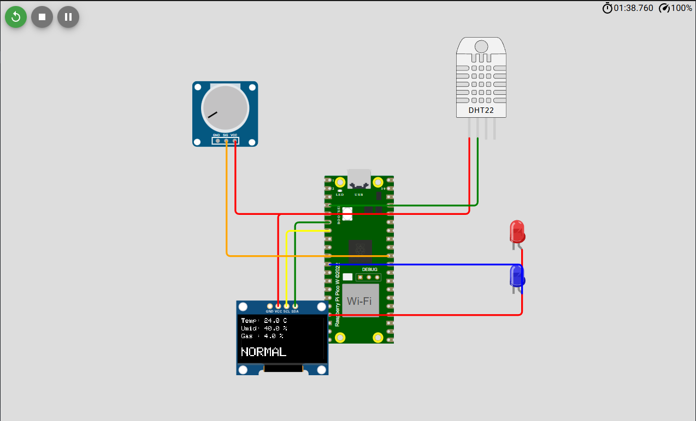
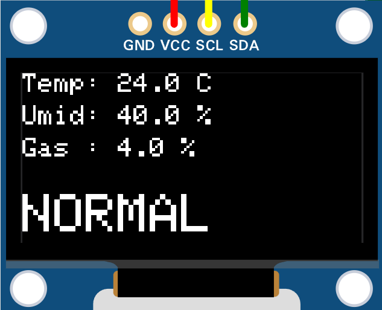

# 🌿 KyberMint EcoNode - Monitorização Ambiental com Edge AI


Este projeto é um nó IoT de alto desempenho (Edge Node) desenvolvido para a monitorização ambiental em tempo real. Afastando-se de simulações de alto nível, o sistema opera diretamente em arquitetura ARM (Raspberry Pi Pico W), processando dados de sensores localmente e utilizando um modelo de Inteligência Artificial (Perceptron) para a tomada de decisão autónoma na borda (Edge Computing).

Projeto desenvolvido no âmbito do 5º semestre da licenciatura em Ciência da Computação (UNIC), aplicando conceitos de Sistemas Digitais, Microprocessadores e Inteligência Artificial Simples.

<table style="width:100%; text-align:center; border-collapse:collapse;">
  <tr>
    <td style="width:50%; padding:10px;">
      <p><b>SIMULAÇÃO DO HARDWARE (WOKWI)</b></p>
      
    </td>
    <td style="width:50%; padding:10px;">
      <p><b>TELEMETRIA E IA (ECRÃ OLED)</b></p>
      
    </td>
  </tr>
</table>

## 🚀 Metas do Projeto e Requisitos
- **Arquitetura ARM:** Implementação nativa para o microcontrolador RP2040.
- **Inteligência Artificial (C/C++):** Motor de inferência (Perceptron de camada única) modularizado para classificar o risco ambiental com base em múltiplas variáveis.
- **Sensores e Atuadores:** Leitura de Temperatura, Humidade e Gás/Qualidade do ar, com resposta visual (OLED, LEDs) e mecânica (Relé).
- **Engenharia de Software:** Código estruturado e modular (`lib/`, `src/`, `include/`) gerido via PlatformIO.

---

## 🛠️ Componentes do Sistema (Hardware Virtual)

- **MCU:** Raspberry Pi Pico W (ARM Cortex-M0+ com suporte Wi-Fi para futuras integrações com o projeto Chronos).
- **Sensor Climático:** DHT22 (Temperatura e Humidade).
- **Sensor de Gás:** MQ-135 (Simulado via potenciómetro analógico).
- **Interface Visual (HUD):** Ecrã OLED SSD1306 (Comunicação I2C).
- **Atuadores:** Relé (Exaustor/Ventilação) e LEDs de Alerta.

---

## 🧠 Arquitetura da Inteligência Artificial

O cérebro do EcoNode é um **Perceptron**. Ele recebe três entradas (Temperatura, Humidade, Gás), aplica pesos sinápticos específicos (dando maior relevância a anomalias na qualidade do ar e temperatura) e soma um valor de viés (*bias*). A função de ativação binária decide instantaneamente se o ambiente está "NORMAL" ou "CRÍTICO", acionando os mecanismos de segurança sem depender de processamento em nuvem.

---

## 💻 Como Executar e Simular (VS Code)

O projeto utiliza o **PlatformIO** para a compilação local da *toolchain* ARM e a extensão **Wokwi** para a simulação do circuito.

1. Instale as extensões **PlatformIO IDE** e **Wokwi Simulator** no VS Code.
2. Clone este repositório e abra a pasta raiz no VS Code.
3. O PlatformIO irá inicializar automaticamente (aguarde a instalação do núcleo *Earle Philhower* e das bibliotecas Adafruit).
4. Compile o código C++ clicando no ícone de **Build (✓)** na barra inferior azul.
5. Pressione `Ctrl+Shift+P` (ou `Cmd+Shift+P`), digite e selecione: `Wokwi: Start Simulation`.

## 📂 Estrutura do Repositório

```text
KyberMint-EcoNode/
├── lib/
│   └── Perceptron/          # Biblioteca C++ da IA isolada do código principal
│       ├── Perceptron.h
│       └── Perceptron.cpp
├── src/
│   └── main.cpp             # Lógica principal, leitura de pinos e interface I2C
├── docs/                    # Imagens e documentação académica do artigo
├── diagram.json             # Ficheiro de roteamento do circuito (CAD Wokwi)
├── wokwi.toml               # Ficheiro de configuração do simulador local
└── platformio.ini           # Gestor de dependências e definições do compilador ARM